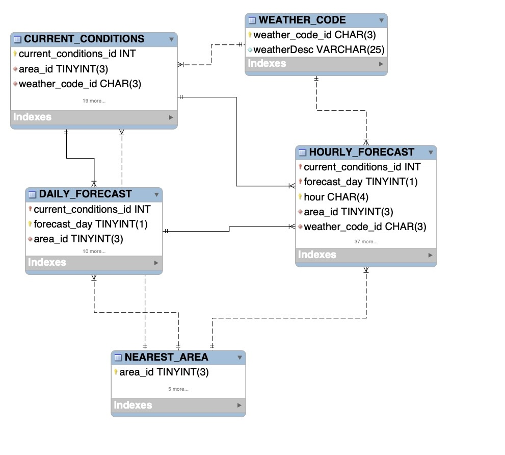

# mysql-etl
ETL Pipeline in Python that ingests weather data for loading into a MySQL database

## Table of Contents
1. [Project Overview](#project-overview)
2. [Features](#features)
3. [Technologies Used](#technologies-used)
4. [Installation](#installation)
5. [Configuration](#configuration)
6. [Usage](#usage)
7. [ETL Process Description](#etl-process-description)
8. [Database Schema](#database-schema)
9. [Error Handling](#error-handling)
10. [License](#license)

----

<h2 id="project-overview">Project Overview</h2>

This project features an ETL pipeline that can be automated to ingest data about the weather for any given location(s), using the [wttr.in API](https://wttr.in), and loads it into a MySQL database. The pipeline processes JSON data and loads it with respect to the relational model of the database.

The data includes detailed information about the weather, such as temperatures, chance of sunshine/rain/overcast, pressures, latitude and longitude of the location, and more. For each city, we can find the current conditions, a 3-day forecast, and 3-hourly forecasted conditions for each day's forecast.

As the data pipeline can be automated, the dataset can grow quickly, which can be used for regular upstream loading into OLAP systems for analysis. This also creates a database system with large tables, closely mimicking real-world use cases to experiment with SQL workloads, query optimization, engine configuration, and more.

----

<h2 id="features">Features</h2>

1. Versatile extraction and load (configurable list of columns and values)
2. Transactional (all or none)
3. Error & progress logging
4. Datatype checking
5. Fully automated

----

<h2 id="technologies-used">Technologies Used</h2>

1. Database: MySQL
2. Programming Language: Python
3. Packages: mysql-connector, json
4. Automation: Shell scripting, Cron

----

<h2 id="installation">Installation</h2>
1. Clone the repository and go to its root directory:
    ```bash
    git clone https://github.com/hadiys/mysql-etl.git
    cd mysql-etl
    ```

2. Setup the virtual environment:
    ```bash
    python3 -m venv <your_venv_name>
    ```

3. Install required packages:
    ```bash
    pip install -r requirements.txt
    ```

> If using MySQL Workbench, ensure to install MySQL server 8.0. Later versions may have compatibility issues.

4. Install MySQL server:

    **On Mac:**
    ```bash
    brew install mysql@8.0
    brew link mysql@8.0 --force 
    mysql_secure_installation
    ```

    * Choose 'Y' for 'Set root password?' and enter your password.
    * Choose 'Y' for all the questions afterwards

    
    **On Windows:**
    Download and install MySQL from [here](https://dev.mysql.com/downloads/installer/).
    
    Follow setup instructions https://youtu.be/u96rVINbAUI. 
    * Choose `8.0.xx` as the version
    * OS: Windows
    * In the installation type, you can choose Server Setup or Custom Setup to install the server + any add ons (i.e: MySQL Workbench)
    
>Save the root user password to connect to the database later

5. Recreate the weather database:
    
    Log into mysql client with your password:
        
    `mysql -u root -p `
    
    Recreate the database and check that it was successfully created:
    ```bash    
    > source weatherdb_backup.sql;
    > USE WEATHER;
    > SHOW TABLES;
    > quit
    ```

----

<h2 id="configuration">Configuration</h2>
1. Create the `.env` file in the root of the project:
    ```bash
    touch .env
    ```

2. Add credentials & log path to `.env`:
    ```bash
    DB=WEATHER
    HOST=localhost
    USER=root
    PW=<your_password>
    LOG_FILE=/your/project/path/etl/log/log.txt
    ```

3. Update paths in the shell script:
    ```bash
    DATA_DIR="/path/to/your/project/etl/data"
    ETL_SCRIPT="/path/to/your/project/etl/etl_job.py"
    LOG_SCRIPT="/path/to/your/project/etl/log.py"
    SERVER_START="/path/to/mysql/bin/mysql.server start"
    SERVER_STOP="/path/to/mysql/bin/mysql.server stop"
    PYENV="/path/to/python_venv/bin/activate"
    PY3="/path/to/python/bin/python3"
    WGET="/path/to/wget/wget"
    ```

----

<h2 id="usage">Usage</h2>
1. Populate the weather codes table (once only):
    ```bash
    python3 extract_weathercodes.py resources/wttr-codes.json
    ```

2. Run the ETL manually or set up a cron job:
    ```bash
    source ./resources/initiate_etl.sh
    ```

3. To automate with crontab:
    ```bash
    crontab -e
    ```

4. Add this line to the cron editor to run the ETL every hour. Replace with actual path:
    ```bash
    * */1 * * * source /path/to/shell_script.sh
    ```


> You can check the status of the operation in the log, or by logging into the MySQL server and querying the database 

----
<h2 id="etl-process-description">ETL Process Description</h2>
The ETL proceeds with respect to the relational model or schema of the data. Since the tables have parent-child relationships, parent tables are populated first, then intermediate tables (ones that are child and also parent) and child tables finally.

The process begins when the `etl_job.py` script is called with an argument that specifies the json file containing our data, extracting/parsing data from json, generating SQL `INSERT` statement, and executing the statement against the database. 

The process is repeated for each entity in the database. If an error occurs during any phase of the ETL, the MySQL transaction is aborted to ensure data consistency in the database and the error is appended to the log file. 

A transaction consists of 1 row describing the current conditions, 3 rows describing 3-day forecast ahead of the current day, and 8 rows describing the forecast every 3 hours for each day. Therefore the transaction creates 28 rows across 3 tables. 

---
<h2 id="database-schema">Database Schema</h2>

>To explore the full schema, run the commands `show tables` or `describe <table_name>` in MySQL Workbench or command-line client.

| Table Type | Table names | 
|---------------|----------------|
| Parent | NEAREST_AREA, WEATHER_CODE | 
| Intermediate |CURRENT_CONDITIONS, DAILY_FORECAST| 
| Child |HOURLY_FORECAST | 



---
<h2 id="error-handling">Error Handling</h2>

Error is handled in 3 error-prone areas:
1. The Python generic `Exception` type. This error is caught during execution for any of the parse functions in `extract.py`, which are responsible for extracting values from the json data.

2. The mysql-connector generic `Error` type. Used in a try-except block to wrap the ETL process as a transaction, and catches any MySQL error that might occur during database interactions. This error can also be caught during the execution of helper functions like `get_area_id()` and `get_weather_code_id()` which also retrieve ids from the database.

3. `ValueError` is implemented as a type-checking mechanism in the helper function `cast_value()`. Since all the json values are strings, the try-except block with a `ValueError` ensures values are returned as their underlying type so that they are correctly inserted into the database (i.e: if the string '23' is inserted into a column with a type `INT` its value will be 0 so it must be casted to `INT`)


>All of the above errors are logged to the log with the following format:<p>timestamp | executing function | message</p>

<h2 id="license">License</h2>
MIT License

Copyright (c) 2024 Hadi Saleh
